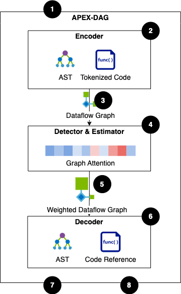
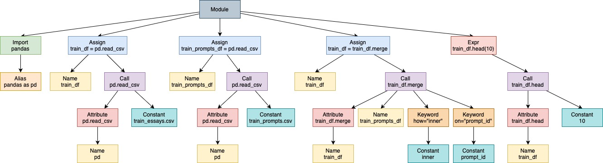

# APEX-DAG: <ins>A</ins>utomating <ins>P</ins>ipeline <ins>EX</ins>traction with <ins>D</ins>ataflow, Static Code <ins>A</ins>nalysis, and <ins>G</ins>raph Attention Networks



## WiP

- [ ] Paper Teaser
- [x] Demonstration Paper (ACM SIGMOD/PODS 2025, Berlin, Germany)
- [x] Encoder (Dataflow Extraction, Tokenizing, Encoding Graph)
- [ ] Detector & Estimator (Graph Attention Network, Training Tasks, Dataset)
- [ ] Decoder (Reconstructing, Highlighting, Filter)

# Environment setup with conda:
```
conda create --name my_env python=3.8
conda activate my_env
pip install -r requirements.txt

conda install --channel conda-forge pygraphviz // requires graphviz
```

# Abstract Syntax Tree 
