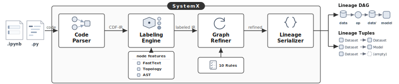

# SystemX

<p align="center">
  
</p>

SystemX extracts data pipelines from computational notebooks and Python scripts.
Unlike execution-based tools, it recovers the dataflow, transformations, and
dependencies of a workflow entirely through static analysis — the code is never run
and never modified. A Graph Attention Network labels the extracted dataflow graph
with semantic operation types, and after training the system generalises to
pipelines built with libraries it has not seen before.

## Requirements

- Python 3.12+
- [uv](https://docs.astral.sh/uv/) for dependency management
- Node.js (only required to build the JupyterLab extension)

## Installation

```bash
./setup_dev.sh
```

This synchronises the Python environment with `uv`, installs the SystemX backend
in editable mode, installs the JupyterLab extension's dependencies, and links the
extension into JupyterLab. On its first run SystemX downloads the FastText model
`cc.en.300.bin` (~3.3 GB) into the repository root.

Activate the environment before running any of the commands below:

```bash
source .venv/bin/activate
```

---

## 1. JupyterLab and the SystemX extension

The extension is the interactive entry point: it renders the dataflow and lineage
graph of the active notebook directly in JupyterLab and lets you inspect,
relabel, and re-run the extraction on demand. `setup_dev.sh` already installs it,
so launching JupyterLab is enough:

```bash
jupyter lab --ip=0.0.0.0 --port=8888 --no-browser
```

Open any notebook and select the SystemX view to visualise its extracted pipeline.

To work on the extension's frontend, run the TypeScript build in watch mode in a
second terminal and refresh JupyterLab to pick up changes:

```bash
cd systemx-jupyter
jlpm run watch
```

---

## 2. Training a model

The default labeler is a Heterogeneous Graph Transformer (HGT) with FastText node
embeddings. It classifies the compute nodes of the dataflow graph from paired
notebooks and gold annotation graphs:

```
data/jetbrains_dataset/notebooks/      # *.ipynb   source notebooks
data/jetbrains_dataset/annotations/    # *.json    gold annotation graphs
```

Train the HGT labeler:

```bash
python -m SystemX.nn.training.v2.train_hgt \
  --annotations_dir ./data/jetbrains_dataset/annotations \
  --output_dir      ./checkpoints/v2 \
  --embedding       fasttext \
  --epochs          30
```

Train the MLP and XGBoost baselines, which operate on a fixed feature vector per
compute node:

```bash
python -m SystemX.nn.training.v2.train_baselines \
  --annotations_dir ./data/jetbrains_dataset/annotations \
  --output_dir      ./checkpoints/v2 \
  --model           both \
  --epochs          100 \
  --features        standard
```

Each run writes a checkpoint (and a `manifest.json`) under `--output_dir`. To
reproduce the paper's evaluation, `SystemX/experiment/ablation/run_cv.sh` runs
5-fold stratified cross-validation over every model and ablation variant and
aggregates the results.

---

## 3. Running the system standalone

SystemX can also be used headlessly to extract the lineage graph of a notebook
without JupyterLab. Point the pipeline at a trained checkpoint (from step 2, or the
one bundled with the extension) and call `execute` on the notebook's code cells; it
returns the labelled lineage graph in Cytoscape JSON format:

```python
import json
import nbformat
from SystemX.experiment.evaluation import build_pipeline

CHECKPOINT = "checkpoints/v2/hgt_fasttext_standard_20260619_025821.pt"

pipeline = build_pipeline(
    config={},
    checkpoint_path=CHECKPOINT,
    v2_checkpoint_path=CHECKPOINT,
)

notebook = nbformat.read("demo/5_titanic.ipynb", as_version=4)
cells = [dict(c) for c in notebook.cells if c.cell_type == "code"]

graph = pipeline.execute(cells)
json.dump(graph, open("lineage.json", "w"), indent=2)
```

To score a trained model against gold annotations, the evaluation module reports
global and per-class precision, recall, and F1, structural recall (the parser
ceiling), and per-notebook timing:

```bash
python -m SystemX.experiment.evaluation \
  --raw_dir            ./data/jetbrains_dataset/notebooks \
  --annotations_dir    ./data/jetbrains_dataset/annotations \
  --v2_checkpoint_path ./checkpoints/v2/hgt_fasttext_standard_20260619_025821.pt \
  --checkpoint_path    ./systemx-jupyter/models/checkpoints/model_epoch_finetuned_GraphTransformsMode.REVERSED_440.pt \
  --config_path        ./systemx-jupyter/models/config/default_reversed.yaml \
  --invariant          standard
```

---

## Repository layout

| Module        | Purpose                                                                    |
| ------------- | -------------------------------------------------------------------------- |
| `parser/`     | Builds the `CDFIntermediateRepresentation` (CDF-IR) from notebook cells    |
| `sca/`        | Static-code-analysis visitor, state/stack, and the graph refinement rules  |
| `pipeline/`   | Factory wiring for the AST, dataflow, labeling, and lineage pipelines      |
| `labeler/`    | Labeler backends: HGT (default), GAT, MLP, XGBoost, and the Vamsa baseline |
| `nn/`         | Graph neural network models, feature extraction, and training loops        |
| `labeling/`   | LLM-based gold-annotation engine and knowledge-base indexing               |
| `serializer/` | Cytoscape-JSON serializers for the extracted graphs                        |
| `mining/`     | Notebook miners and knowledge-base builders for dataset construction       |
| `experiment/` | Evaluation, ablation, and metrics drivers                                  |
| `vamsa/`      | Reimplementation of the Vamsa provenance baseline                          |

The JupyterLab extension lives under `systemx-jupyter/`.

## License

See [LICENSE](LICENSE).
